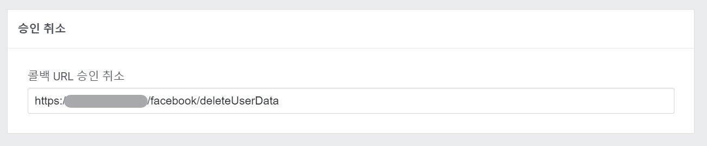
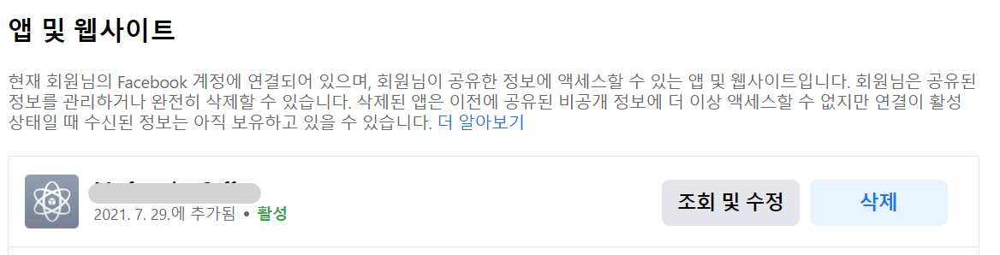

## Sample.App

웹 응용프로그램은 아래와 같이 `MVC` 템플릿을 사용해서 작성되었습니다.

```
$ dotnet new mvc --auth Individual
```

그 후 SQLite 대상으로 하는 코드를 SQLServer 로 변경했습니다.

### Add migration

```bash
$ dotnet ef migrations add "Initialize database" --context ApplicationDbContext --output-dir Data/Migrations
```

### Appsettings

웹 응용프로그램 프로젝트의 `appsettings.json` 파일을 환경에 맞게 편집해야 합니다.

```json
{
    "ConnectionStrings": {
        "DefaultConnection": "DataSource=app.db;Cache=Shared"
    },
    "Authentication": {
        "Facebook": {
            "AppId": "<app-id>",
            "AppSecret": "<app-secret>"
        }
    },
    // 
}
```

`App id`, `App secret` 의 값은 [Facebook 앱](https://developers.facebook.com/apps)을 작성하면 확인할 수 있습니다.

## Facebook 로그인 설정

페이스북 앱 콘솔에서 페이스북 로그인 설정 페이지의 승인 취소 영역에 사용자가 앱을 삭제하는 경우 요청될 URL을 설정할 수 있습니다.



## 앱 삭제

페이스북 설정 페이지의 앱 및 웹사이트 페이지에서 로그인이 사용된 앱 및 웹사이트 목록을 확인할 수 있습니다.

그리고, 목록에서 로그인 삭제를 할 수 있습니다.

사용자가 앱 및 웹사이트 목록에서 앱 또는 웹사이트를 삭제하는 경우 등록해둔 승인 취소 콜백 URL에 POST 요청이 실행됩니다.



## 승인 취소 콜백

승인 취소 콜백으로 등록된 URL에 POST 요청이 실행될 때, [Facebook: App and website](https://www.facebook.com/settings/?tab=applications) 페이지의 설명과 같이 POST 요청 본문의 `signed_request` 값에서 로그인에 사용된 `user_id` 를 참조할 수 있습니다.

`php` 로 작성된 예제 코드를 제공하고 있습니다.

이 코드를 C# 으로 작성하면 [GitHub: bbonkr/sample.external.login](https://github.com/bbonkr/sample.external.login) 저장소의 [`src/Sample.App/Services/FacebookService.cs`](https://github.com/bbonkr/sample.external.login/blob/main/src/Sample.App/Services/FacebookService.cs) 와 같이 작성할 수 있습니다.


